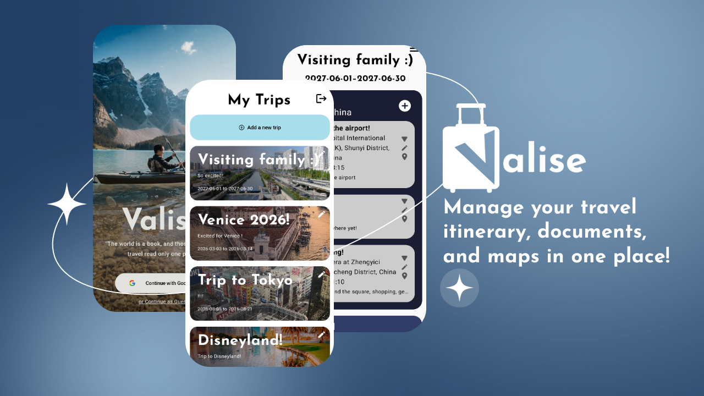

(For detailed guide, visit [User Documentation](https://github.com/MatthewLi-UW/Valise/wiki/User-Documentation))

Valise

## Introduction
`Valise` is a robust platform designed to revolutionize how we travel. The program simplifies your journey by organizing everything you need in one place. Build detailed itineraries, securely store travel documents, manage hotel bookings and tickets, and explore your destinations with personalized maps—all in a sleek, user-friendly app. Seamless, stress-free travel planning is just a tap away with `Valise`!

## Installation Guide
Click the latest release below and download the release APK file. If using an Android Virtual Device (AVD) or Emulator, follow the following steps.
  1. Start the AVD by opening Android Studio, and click the green arrow on the toolbar. Ensure Medium Phone API 35 (the default) is selected. This should be the default.
  2. If it is not, open the Device Manager tab on the rightmost toolbar. Click +, select Medium Phone, and API level 35, and create a new AVD.
  3. Drag the APK to the home screen once the AVD is loaded.

If running on a physical device, the following steps vary from device to device, but usually follow the following:
  1. Open Settings 
  2. Navigate to Security or Privacy 
  3. Enable the Install unknown apps or Unknown sources option
  4. Navigate to the downloaded APK file using the File manager, and tap to install.

## Contributors
Victor Liu v37liu@uwaterloo.ca

Michael Chen m52chen@uwaterloo.ca

Matthew Li mf5li@uwaterloo.ca

Cristal Lu c23lu@uwaterloo.ca

## Resources
[User Documentation](https://github.com/MatthewLi-UW/Valise/wiki/User-Documentation)
